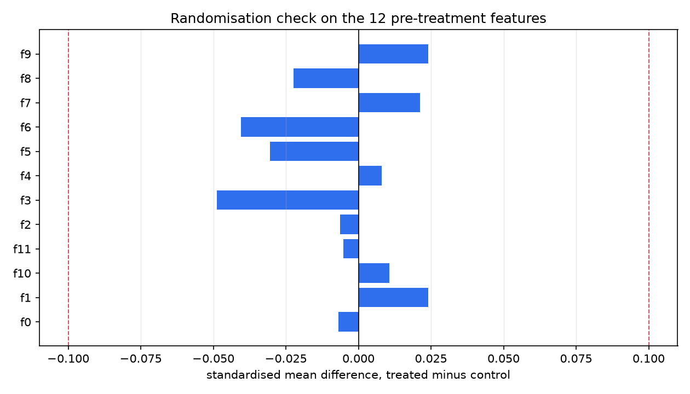
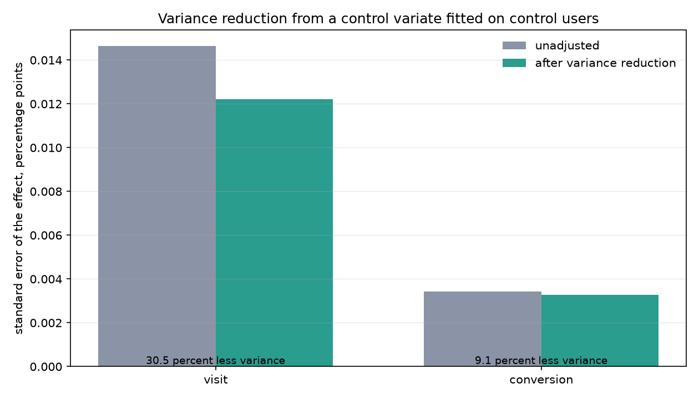
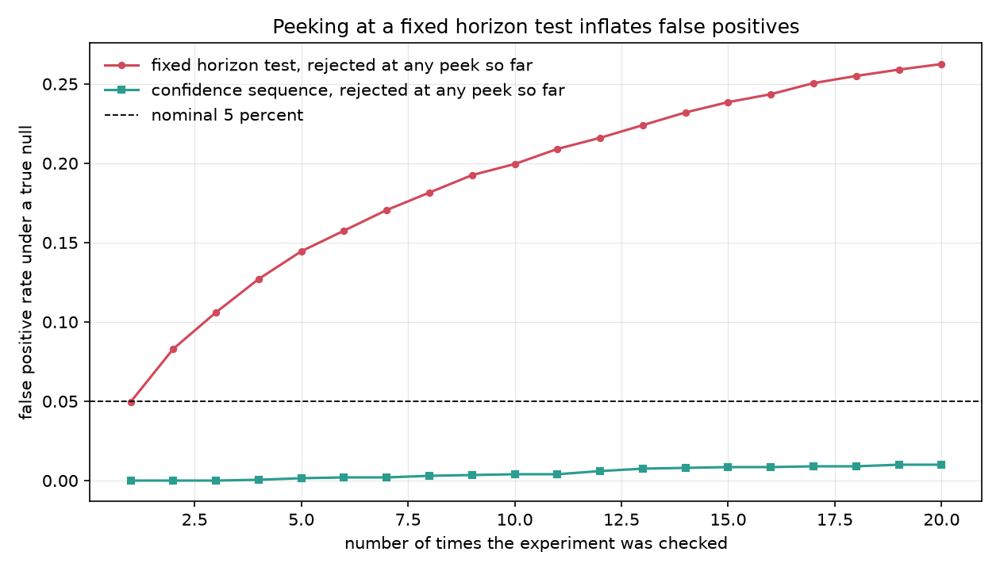
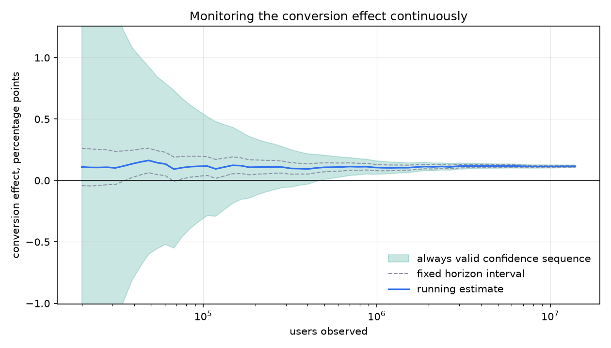
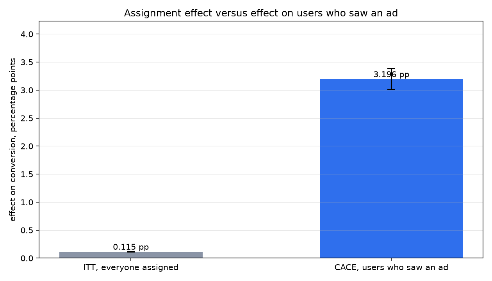
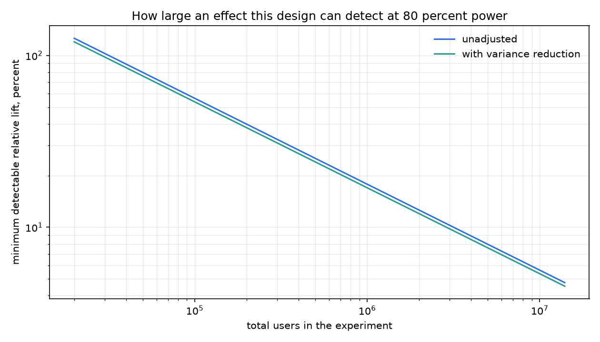
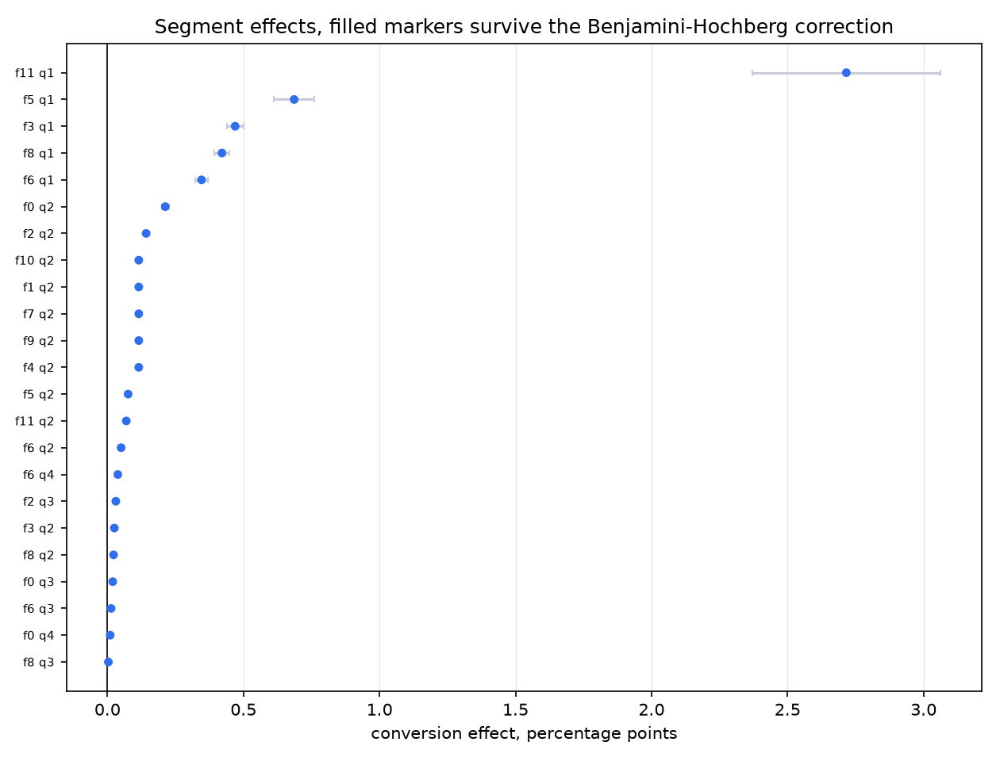
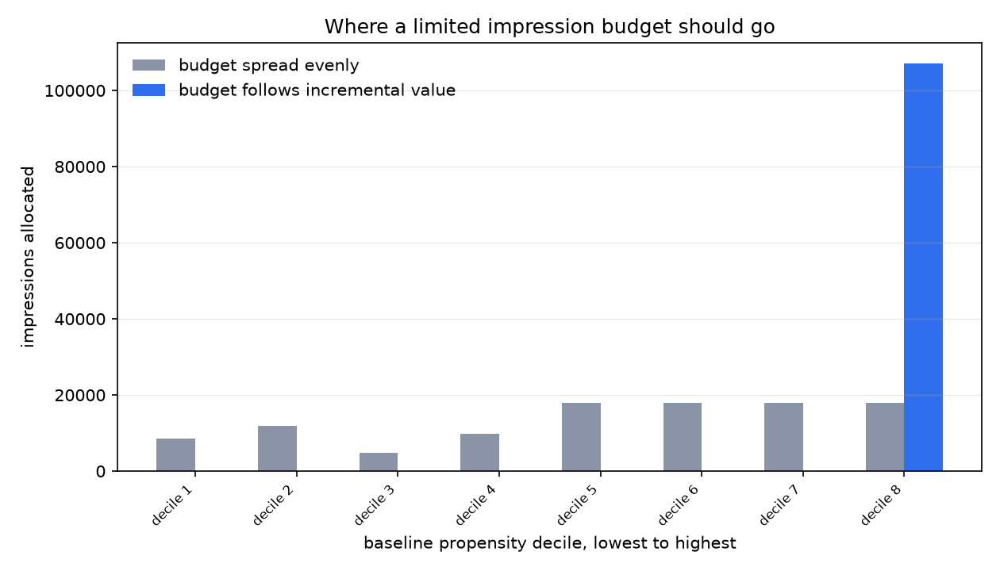

# Experiment analysis engine

An analysis engine for one large randomised advertising experiment. It reads the raw Criteo uplift file, checks whether the randomisation held, estimates the effect four different ways, and ends with a budget split that follows from those estimates.

Every number below was measured on the full file of 13,979,592 users. The run writes them to `artifacts/run_summary.json` and this README quotes that file.

## The experiment

Criteo published the logs of a randomised advertising experiment. Each row is one user. The user was assigned to treatment or control, treated users became eligible to see an ad, and the row records whether the user visited the advertiser and whether the user converted. Twelve features describe the user before assignment. They are anonymised, so there is nothing to read into them beyond their values.

The file is the [Criteo uplift prediction dataset](https://ailab.criteo.com/criteo-uplift-prediction-dataset/), released with [A Large Scale Benchmark for Uplift Modeling](http://papers.adkdd.org/2018/papers/adkdd18-diemert-large-scale.pdf) at AdKDD 2018. This engine expects version 2.1, which is also mirrored on [Hugging Face](https://huggingface.co/datasets/criteo/criteo-uplift).

| Fact | Value |
| --- | --- |
| Users | 13,979,592 |
| Assigned to treatment | 11,882,655 (85.0 percent) |
| Assigned to control | 2,096,937 |
| Treated users who saw an ad | 428,212 (3.60 percent) |
| Control users who saw an ad | 0 |
| Visit rate, control then treated | 3.8201 percent, 4.8543 percent |
| Conversion rate, control then treated | 0.19376 percent, 0.30895 percent |

`expengine verify` recomputes every one of these from the raw file and compares it against the value Criteo published. It exits non zero if any of them drift, and the pipeline refuses to run on a file that fails the check.

## What the engine does

The whole run is one command. It moves through these stages.

1. Cache. The gzipped CSV is read a million rows at a time and written as a typed parquet file, so later stages can pull one column at a time instead of holding the file in memory.
2. Facts. The published counts and rates are recomputed and compared against the file.
3. Sample ratio mismatch. A chi square test on the assignment counts against the intended 85/15 split.
4. Balance. A standardised mean difference and a z statistic for each of the twelve features.
5. Intention to treat. The difference in proportions for visit and conversion, with the relative lift built on the log scale.
6. Variance reduction. Gradient boosting trained on control users only, cross fitted across four folds, gives a predicted outcome that serves as a CUPED covariate.
7. Always valid inference. An A/A simulation measures what repeated peeking costs, and a confidence sequence tracks the real effect as users arrive.
8. Instrumental variables. Assignment is the instrument for exposure, which turns the assignment effect into the effect on users who actually saw an ad.
9. Incrementality. The conversions that simple attribution would claim are set against the conversions the experiment says were caused.
10. Power. The smallest effect this design could detect, and the sample size the observed effect needed.
11. Segments. Effects inside quartiles of each feature, with Benjamini Hochberg control across the whole family.
12. Allocation. Impressions are ranked by the effect in each covariate decile, and a fixed budget is spent greedily against an even split.

## Results

### The split is the right size, the features are not quite balanced

The assignment counts land on the intended 85/15 split almost exactly. The chi square statistic is 0.0000018 on one degree of freedom, which gives p 0.9989. Nothing about the assignment counts looks broken.

The features are a different matter.



The largest standardised mean difference across the twelve features is 0.0488 on f3 and the mean is 0.0207, both under the 0.10 the engine treats as a practical failure, so the guardrail passes. The z statistics are another story. f3 sits 67 standard errors away from its control mean, and all 12 of them sit beyond three. At fourteen million rows a gap this small is still far larger than sampling noise, so the two arms are close but not interchangeable. That comes back in the next section.

### The effect of being assigned to treatment

| Outcome | Control | Treated | Effect | 95 percent interval | Relative lift | z |
| --- | --- | --- | --- | --- | --- | --- |
| Visit | 3.8201 percent | 4.8543 percent | 1.0342 pp | 1.0056 to 1.0629 pp | 27.1 percent | 71 |
| Conversion | 0.19376 percent | 0.30895 percent | 0.1152 pp | 0.1085 to 0.1219 pp | 59.4 percent | 34 |

The relative lift interval comes from the standard error of the log ratio rather than from dividing the ends of the absolute interval, which keeps it asymmetric and stops it running negative.

### The control variate cuts the variance and moves the estimate

The covariate is a prediction of the outcome from the twelve features. It is trained on control users only and cross fitted over four folds, so a user's own outcome never sits inside their own covariate and the treatment effect cannot leak into it.



| Outcome | Correlation | Variance reduction | Effective sample multiplier | Assigned effect | Adjusted effect |
| --- | --- | --- | --- | --- | --- |
| Visit | 0.57 | 30.5 percent | 1.44 | 1.0342 pp | 0.7402 pp |
| Conversion | 0.35 | 9.1 percent | 1.10 | 0.1152 pp | 0.1015 pp |

Visit gains the most because the features predict it reasonably well. Conversion is rarer and harder to predict, correlation 0.35 against 0.57, so it gains less.

The adjusted point estimates also move, and by more than a standard error. That is the feature imbalance from the previous section showing up in the estimate. Where the arms differ on the features they differ on the covariate too, and the adjustment takes that part of the gap back out. The adjusted numbers are the ones worth reporting.

### What peeking costs



2,000 simulated A/A experiments, 20 evenly spaced looks, 50,000 users per arm, no true effect anywhere. A single look at the end rejects 5.15 percent of the time, which is the 5 percent it should be. Stopping at the first significant look across all twenty rejects 26.25 percent of the time. The always valid confidence sequence, checked at the same twenty points, rejects 1.00 percent.



The raw file is sorted by arm, with treated users first, so walking it front to back would show no control users at all for the first five million rows. The monitor walks a fixed random arrival order instead. The fixed interval first excludes zero at 38,931 users and the sequence needs 500,215, which is what being allowed to stop at any time costs.

### The effect on users who saw an ad

Only 3.60 percent of treated users actually saw an ad, and no control user did. One sided non compliance like that is what instrumental variables are for. Assignment is the instrument, exposure is the treatment, and the Wald ratio gives the effect on the users who saw an ad because they were assigned to treatment.



The conversion effect on those users is 3.1964 pp, 27.7 times the assignment effect, interval 3.0100 to 3.3828 pp. The first stage F statistic is 444,220, so the instrument is nowhere near weak.

Comparing exposed users against every control user, which is what reading the log naively would do, gives 5.1847 pp instead, 1.62 times the correct number. Exposure is not random. The users who saw an ad are the ones who were browsing anyway.

### Attribution against incrementality

The treated arm produced 36,711 conversions. The experiment says 13,687 of them were caused by the campaign, interval 12,887 to 14,488. Crediting the campaign with the whole treated arm overstates it by 2.68 times. Crediting it with only the users who saw an ad still overstates it by 1.68 times.

### How small an effect this design could see



At the full sample and 80 percent power the smallest conversion lift this design could detect is 4.76 percent relative, 0.0092 pp absolute. The control variate brings that to 4.54 percent. The lift that turned up is far larger, so the experiment was heavily overpowered for it. 89,724 users would have been enough, against the 13,979,592 it ran on.

### Where the effect is strongest



Every feature is cut into quartiles, which leaves 23 usable segments once ties collapse some of the cuts. Every one of the 23 segments is significant on its own p value, and every one survives Benjamini Hochberg at 5 percent across the family, so the correction removes none of them. That is what happens when each segment holds hundreds of thousands of users and the effect is this large. The effect is far from flat across segments, which is what makes the last stage worth doing.

### Splitting a budget



Users are placed in deciles of the control variate, which is a baseline propensity to convert, and each decile gets its own effect estimate. Take 25 percent of the impressions the campaign actually served, 107,053 of them, and spend them greedily on the deciles with the largest effect per impression. That gives 5,244 incremental conversions against 1,786 for an even split, a factor of 2.94.

The same data both ranks the deciles and scores the gain, so the factor is closer to an upper bound than to a forecast.

## Running it

Python 3.10 or newer. This run used Python 3.13.7.

```
pip install -e ".[dev]"
```

Download `criteo-research-uplift-v2.1.csv.gz` from the [dataset page](https://ailab.criteo.com/criteo-uplift-prediction-dataset/) or the [Hugging Face mirror](https://huggingface.co/datasets/criteo/criteo-uplift) and drop it in `data/raw/`. It is 311 MB gzipped. Then:

```
expengine verify
expengine run
```

`verify` builds the parquet cache and checks the published facts. `run` walks every stage and writes to `artifacts/` and `reports/figures/`. Fitting the control variate is nearly the whole cost. A first run took about twenty minutes on my laptop, sixteen of them predicting the covariate for every user. The fitted covariate is cached in `data/processed/control_variate.npz`, so the next run finished the same twelve stages in 37 seconds. Pass `--refit` to fit it again, or `--skip-figures` for the tables alone.

Set `EXPENGINE_RAW_DIR`, `EXPENGINE_PROCESSED_DIR`, `EXPENGINE_ARTIFACTS_DIR` or `EXPENGINE_FIGURES_DIR` to move any of those folders somewhere else.

## Tests

```
pytest -q
ruff check .
```

64 tests, and none of them need the real file. Every estimator is checked against data where the answer is already known. Theta has to recover a regression slope. CUPED has to return a known effect, averaged over four independent replications so one unlucky draw cannot fail it. The Wald estimator has to return a simulated complier effect. The streaming moments have to match a single pass over the same numbers. Benjamini Hochberg is checked against its own definition rather than against a library.

The style tests take a different route. They read `git ls-files` and scan every tracked file for comments, docstrings, non ASCII bytes, absolute paths and email addresses, and they fail if that listing comes back empty rather than passing on nothing.

CI runs the same checks on Python 3.10, 3.11, 3.12 and 3.13.

## Layout

```
src/expengine/
  cli.py                   cache, verify and run
  config.py                every threshold and constant
  pipeline.py              the stages in order
  data/loader.py           raw file to parquet, published fact check
  guardrails/srm.py        sample ratio mismatch
  guardrails/balance.py    standardised mean differences
  inference/itt.py         difference in proportions, relative lift
  inference/cuped.py       streaming moments, cross fitted control variate
  inference/sequential.py  peeking simulation, confidence sequence
  inference/iv.py          Wald estimator, incrementality
  inference/power.py       minimum detectable effect
  hte/segments.py          quartile segments, Benjamini Hochberg
  policy/allocate.py       greedy against even allocation
  viz/plots.py             the eight figures
tests/                     one file per module, plus the style scans
artifacts/                 the tables and run_summary.json from the last run
reports/figures/           the figures from the last run
```

## License

MIT.
